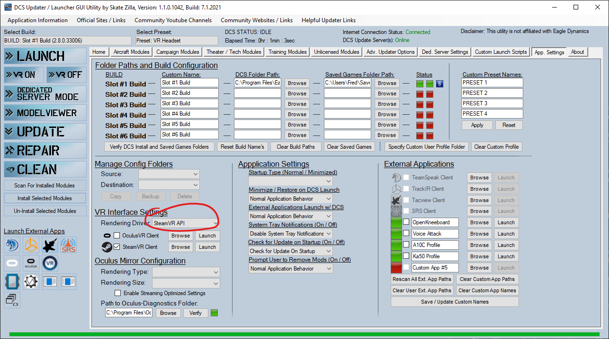

# DCS World

1. Install [OpenComposite] and enable it for DCS World. If you need help, go to [the OpenComposite Discord](https://discord.gg/sQ2jwSb62J)
2. If using controller emulation, you probably want to hide DCS's default gloved hands. Inside DCS's installation folder, find `CoreMods\characters\models\glove_L.chanimgpu` and `glove_R.chanimgpu` - inside these files, change the `scale` to `0`
3. If using a PointCTRL with custom firmware, unbind the PointCTRL X and Y axes within DCS
4. Launch DCS with the `--force_steam_VR` option, or if you're using Skatezilla's launcher, select SteamVR. You must do this even if you're not using Steam, and even if you have an Oculus headset.
5. If using touchscreen emulation, enable DCS's option to lock the mouse cursor to the window
6. If using a virtual VR controller, enable DCS's option to support touch controllers in VR settings

.

## FAQ

### Oculus hand tracking gesture controls

- Index finger pinch to thumb: left click/tVR thumbstick down
- Middle finger pinch to thumb: right click/VR thumbstick up
- Ring finger pinch to thumb: scroll wheel up/VR thumbstick left
- Little finger pinch to thumb: scroll wheel down/VR thumbstick right

### Why is OpenComposite and SteamVR mode needed for Oculus headsets, when DCS World has native support for Oculus headsets?

Hand tracking is only supported by Meta in OpenXR games, so OpenComposite must be used to run DCS using OpenXR.

DCS must be launched in SteamVR mode because OpenComposite works by pretending to be SteamVR.

### Why is OpenComposite and SteamVR mode needed, even if using touch screen emulation?

This project uses OpenXR to get the field-of-view of the headset and the window, which is used for the touchscreen window mapping.
