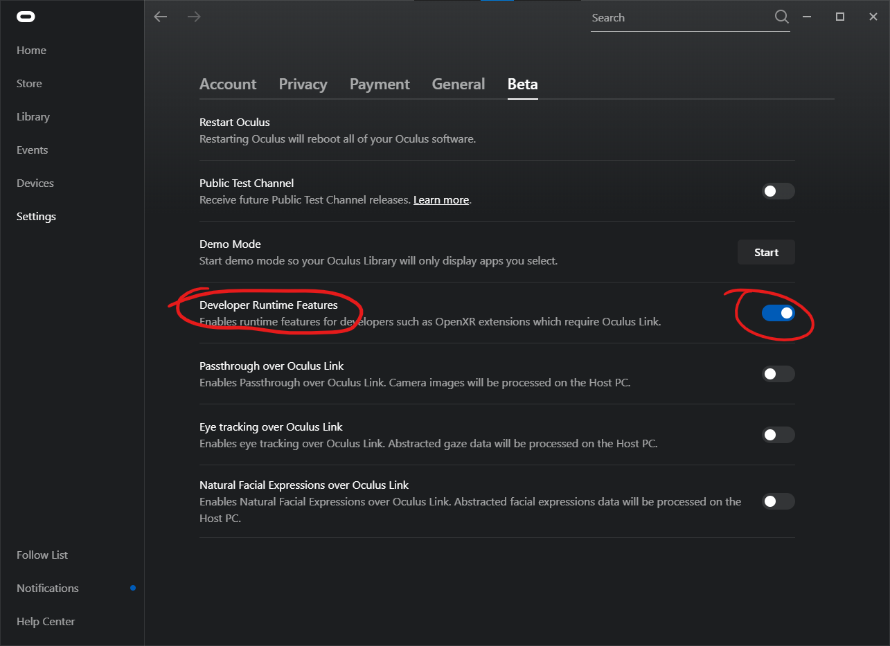

# Oculus Hand Tracking

"Hand tracking" via link is considered a developer feature by Meta, so there's a few hoops you need to jump through.

This is only tested with a Quest 2 and a Quest Pro. It probably doesn't work with a Rift S.

1. Enable hand tracking in your headset - [documentation](https://www.meta.com/help/quest/articles/headsets-and-accessories/controllers-and-hand-tracking/hand-tracking/)
2. Set up your account as an Oculus Developer account - [documentation](https://developer.oculus.com/documentation/native/android/mobile-device-setup/) - you do not need to allow USB debugging or install the ADB drivers
3. Restart the Oculus PC software
4. Enable 'Developer Runtime Features' under Settings -> Beta. If you don't see the option yet, try again later - it can take a few hours
5. In HTCC settings, set 'hand tracking source' to 'OpenXR Hand Tracking'

## Virtual Desktop

- you must use VDXR
- turn on 'send tracking data to PC' so that your PC - and HTCC - receive the hand tracking data
- turn *off* hand tracking in Virtual Desktop, otherwise its' own controller emulation will be used instead. It is possible to mix both, but complicated, and makes it much harder to diagnose issues

## Sleep/wake

Hand tracking and gesture recognition is not perfectly reliable; it will hopefully improve with future Oculus firmware updates.

HTCC reduces the changes of accidental clicks by:
- adding sleep/wake mode
- ignoring gestures unless you're looking close to your hand

'Wake' hand tracking by waving your hand close to the center of your view. Tracking will 'sleep' for that hand after a few seconds of little movement.

The limits can be tweaked [in the registry](../settings.md) if needed.

## FAQ

### Why do pinch gestures require Oculus headsets?

The [`XR_FB_hand_tracking_aim`] OpenXR extension is required, which is currently only supported by Oculus headsets.

Other headsets would work if other OpenXR runtimes add support for `XR_FB_hand_tracking_aim`, or if other projects emulate it using [`XR_EXT_hand_tracking`] or vendor-specific APIs. I am not aware of any projects doing this at present.

Standard OpenXR hand tracking via `XR_EXT_hand_tracking` does not provide enough similar precise gestures.
