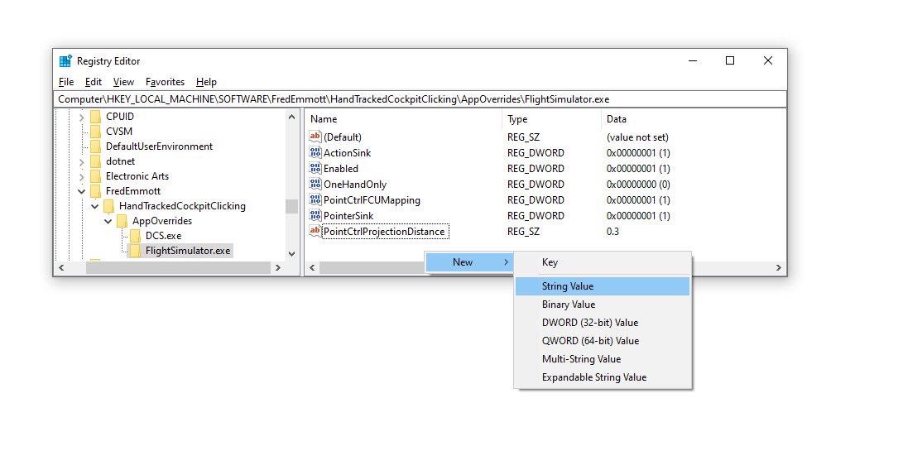

# PointCTRL v2

- if using PointCTRL as a hand tracker, set 'Hand tracking device' to 'PointCTRL'
- if using the FCUs as buttons, disable the gesture recognition options

Requirements:

- you must be comfortable updating the firmware
- you must have a PointCTRL v2, not v1

## Custom Firmware (required)

**WARNING:** After installing the custom firmware, the PointCTRL will *only* work as a joystick, not as a
mouse/touchscreen - you will not be able to use it without this project unless you restore the standard firmware. The
custom firmware does work for DCS, as long as you are using OpenXR.

1. Download [the latest standard firmware and firmware update tools](https://pointctrl.com/firmware/)
2. Unzip it
3. Make a backup copy of `PointCTRL_Update_Data\firmware.hex` - this is the standard firmware that you will need to
   restore if you want the original PointCTRL functionality
4. Replace that file with the latest firmware file from [GitHub Releases], renaming it to `firmware.hex`
5. Follow PointCTRL's instructions for updating the firmware; if you need help, ask in the [PointCTRL Discord]

[GitHub Releases]: https://github.com/fredemmott/hand-tracked-cockpit-clicking/releases/latest

[my Discord]: https://go.fredemmott.com/discord

[PointCTRL Discord]: https://discord.gg/JktNJ2ptKm

## Button Mappings

The PointCTRL FCUs have 3 buttons, but we need 4 actions: left click, right click, scroll up, scroll down. The installer
lets you choose between 2 ways to do this:

### Classic

- FCU1: left click
- FCU2: right click
- FCU3: if FCU2 was pressed more recently than FCU1, scroll up; otherwise, scroll down

### Modal

There are two modes:

- normal mode: FCU1 is left click, FCU2 is right click
- scroll mode: FCU1 is scroll up, FCU2 is scroll down

In both modes:

- short-tap FCU3 to switch to normal mode
- long-press FCU3 to switch to scroll mode

### Modal with left click lock

Like modal, but additionally, pressing FCU1 and FCU2 together ends scroll mode with 'left click' held. This can be
useful for 'click-hold-and-scroll' controls.

This feature requires HTCC v1.1 or above.

## Projection distance

The PointCTRL HMS only detects left/right and up/down position - not distance. You can choose what distance is used for
emulated VR controllers in the registry at:

- `HKEY_LOCAL_MACHINE\SOFTWARE\Fred Emmott\HandTrackedCockpitClicking`: default for games
- `HKEY_LOCAL_MACHINE\SOFTWARE\Fred Emmott\HandTrackedCockpitClicking\AppOverrides\MYGAME.exe`

Within these registry keys (folders), create a string value called `ProjectionDistance`, containing a distance in
meters. For example, to make the emulated controller in MSFS feel 30cm away:

