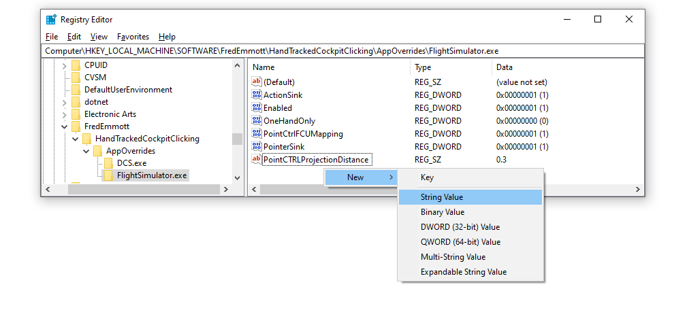

# PointCTRL v2

Requirements:
- you must be comfortable updating the firmware
- you must have a PointCTRL v2, not v1

**WARNING:** After installing the custom firmware, the PointCTRL will *only* work as a joystick, not as a mouse/touchscreen - you will not be able to use it without this project unless you restore the standard firmware.

1. Download [the latest standard firmware and firmware update tools](https://pointctrl.com/firmware/)
2. Unzip it
3. Make a backup copy of `PointCTRL_Update_Data\firmware.hex` - this is the standard firmware that you will need to restore if you want the original PointCTRL functionality
4. Replace that file with the latest firmware file from [GitHub Releases] or the #hand-tracking channel in [my Discord], renaming it to `firmware.hex`
5. Follow PointCTRL's instructions for updating the firmware; if you need help, ask in the [PointCTRL Discord]

[GitHub Releases]: https://github.com/fredemmott/hand-tracked-cockpit-clicking/releases/latest
[my Discord]: https://go.fredemmott.com/discord
[PointCTRL Discord]: https://discord.gg/JktNJ2ptKm

## Projection distance

The PointCTRL HMS only detects left/right and up/down position - not distance. You can choose what distance is used for emulated VR controllers in the registry at:

- `HKEY_LOCAL_MACHINE\SOFTWARE\FredEmmott\HandTrackedCockpitClicking`: default for games
- `HKEY_LOCAL_MACHINE\SOFTWARE\FredEmmott\HandTrackedCockpitClicking\AppOverrides\MYGAME.exe`

Within these registry keys (folders), create a string value called `PointCtrlProjectionDistance`, containing a distance in meters. For example, to make the emulated controller in MSFS feel 30cm away:

