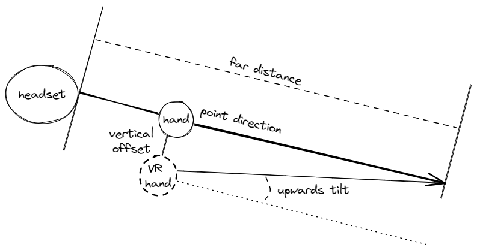

# Registry Settings

All settings are in the registry, in `HKEY_LOCAL_MACHINE\SOFTWARE\FredEmmott\HandTrackedCockpitClicking`; per-app overrides are in `HKEY_LOCAL_MACHINE\SOFTWARE\FredEmmott\HandTrackedCockpitClicking\AppOverrides\EXECUTABLE_NAME.exe\`, e.g. `AppOverrides\DCS.exe\`

## Enabled

DWORD 0 (disabled) or 1 (enabled); enable or disable the entire API layer.

This should usually be 0 to disable for the majority of games, but overriden to 1 in `AppOverrides\DCS.exe`.

## PointerSource

DWORD: which device is used to set the cursor location

- 0: Oculus hand tracking
- 1: PointCtrl

## PointerSink

DWORD: which device is emulated for pointing

- 0: touch screen (classic PointCtrl)
- 1: VR controllers

## ClickActionSink

DWORD: which device is emulated for clicking

- 0: match PointerSink
- 1: touch screen/mouse
- 2: VR controllers

## ScrollActionSink

DWORD: which device is emulated for scrolling

- 0: match PointerSink
- 1: touch screen/mouse
- 2: VR controllers

## VerboseDebug

DWORD: 0..n

- 0: off
- 1: verbose initialization, major state changes
- 2: periodic changes
- 3: every frame
- 4...n: increasingly spammy

Debug output is visible in a debugger or DebugView

## MirrorEye

DWORD 0 or 1:

- 0: left eye
- 1: right eye

This affects cursor emulation, and should match the DCS mirror settings

## PinchToClick

DWORD 0 (disabled) or 1 (enabled): use Oculus hand tracking pinch gestures to click

## PinchToScroll

DWORD 0 (disabled) or 1 (enabled): use Oculus hand tracking pinch gestures to scroll

## OneHandOnly

DWORD 0 (disabled) or 1 (enabled): only render one controller at a time.

Some games (including DCS) assume that you pick up one controller at a time to point at one specific thing; with real controllers like DCS is designed for, this works well and is reasonable. For hands, its' common to have both visible, but DCS will always use the left controller for pointing if two controllers are active, even if only one is visible.

With this option enabled (default), it will prefer:
1. whichever is performing any gestures, if any
2. whichever is currently closer to the center of the field of view

## ShortPressLongPressMilliseconds

DWORD, number of milliseconds for the boundary between a short press and a long press; this affects the PointCTRL MSFS bindings.

## ScrollWheelMilliseconds

DWORD, number of milliseconds between emulated scroll wheel ticks when using virtual mouse/touch screen as action sink.

## ScrollWheelAccelerationMilliseconds

DWORD, number of milliseconds to wait before speeding up the scroll wheel.

## PointCtrlFCUClicks

DWORD 0 (disabled) or 1 (enabled): use PointCtrl FCU button clicks to click or scroll

## PointCtrlProjectionDistance

String (SZ) containing a distance in meters to project virtual hands when using a PointCtrl. For example, `0.6` for 60cm.

## PointCtrlCenterX, PointCtrlCenterY, PointCtrlRadiansPerUnitX, PointCtrlRadiansPerUnitY

CenterX and Y are DWORD 0..65535
PointCtrlRadiansPerUnitX and Y are floats as strings.

These values should be set with the included `PointCtrlCalibration.exe` program.

## PointCtrlFCUMapping

DWORD:

- 0: Classic
- 1: Modal (intended for MSFS, but no longer required due to other changes)
- 2: Modal, but long-pressing buttons 1 & 2 together enters scroll lock mode but with  button 1 held

## VRVerticalOffset

String (SZ) containing a distance in meters, e.g. `-0.04` (4cm down).

The emulated VR controller is positioned slightly below your hand, and angled slightly up to make the 'laser pointer' more visible. This adjusts how far below it is.

The pointing angle is based on this distance, combined with the `VRFarDistance` setting.

## VRFarDistance

String (SZ) containing a distance in meters, e.g. `0.8` (80cm away).

Rough distance from your head to the majority of things you want to interact with. Combined with `VRVerticalOffset`, this sets the upwards rotation of the pointer; a shorter 'far distance' will increase the amount of rotation, a longer one will reduce it:

# VRControllerActionSinkMapping 

DWORD:

- 0: [DCS](dcs-world/README.md)
- 1: [MSFS](msfs/README.md)

Which game's mappings are used for VR controllers.

# VRControllerPointerSinkWorldLock 

DWORD

- 0: clicking does not affect tracking
- 1 - orientation: any click/wheel action locks the angle of the pointer, but not the position
- 2 - hard-lock orientation, soft-lock position: as above, however the position will also be unlocked until your hand moves a certain distance

# VRControllerPointerSinkSoftWorldLockDistance

STRING

Distance in meters (e.g. "0.05" for 5cm). While 'clicking', the virtual controllers will stay locked in position until your hand moves this far from the original position.

# VRControllerActionSinkSecondsPerRotation

STRING

Number of seconds for a mouse wheel event to trigger a full rotation of the controller when using MSFS bindings. For example, "4.0"

## PointCtrlVID, PointCtrlPID (firmware developers and custom button boxes only)

DWORDs containing 16-bit USB vendor and product IDs.

Change the USB vendor ID and product ID that this project looks for when trying to find a PointCTRL device.

## PointCtrlFCUButtonL1-L3, PointCtrlFCUButtonR1-R3 (firmware developers and custom button boxes only)

DWORD button indices starting at 0.

FCU L1 is the button farthest from your wrist on your left hand, L3 is closest. R1-R3 are the buttons on your right hand.

# UseHandTrackingAimPointFB (developers only)

DWORD 0 (disabled) or 1 (enabled): Use the FB-provided 'aim' point instead of a skeletal joint.

# HandTrackingAimJoint (developers only)

DWORD: joint index for aim joint. See the OpenXR specification.

# HandTrackingOrientation (developers only)

DWORD:

- 0 (raw): The hand joint orientation/rotation reported by OpenXR is used unmodified
- 1 (ray cast): Discard the orientation/rotation of your hand, and instead rotate it to fit a laser pointer from the center of your headset. This will improve accuracy and stability, but if controller models are enabled in-game, it may feel weird. Leaving this on is recommended.

# EnableFBOpenXRExtensions (developers only)

DWORD 0 (disabled) or 1 (enabled): Enable the use of Facebook/Meta/Oculus-specific OpenXR extensions for hand tracking. This is required for the pinch gestures.

To disable pinch gestures, use the `PinchToClick` and `PinchToScroll` settings instead. This is primarily intended for checking that this project can function without them.

# VirtualControllerInteractionProfilePath (developers only)

STRING: OpenXR path to the interaction profile of the emulated controllers.
